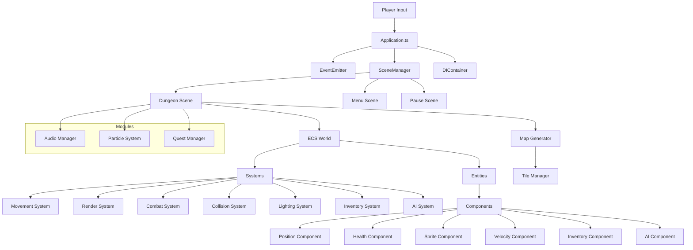
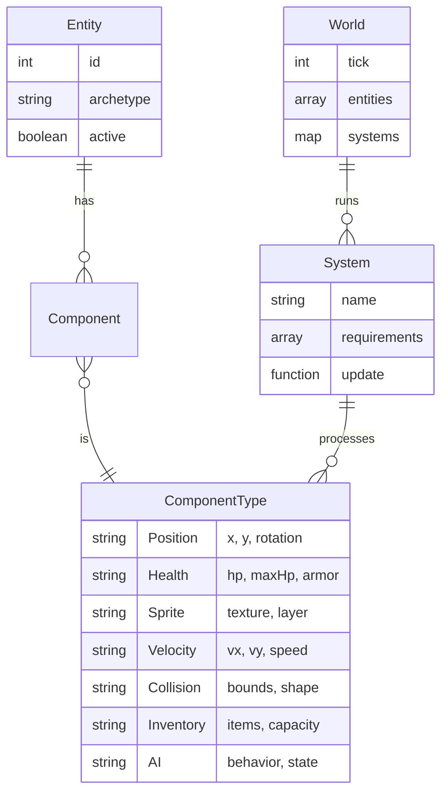
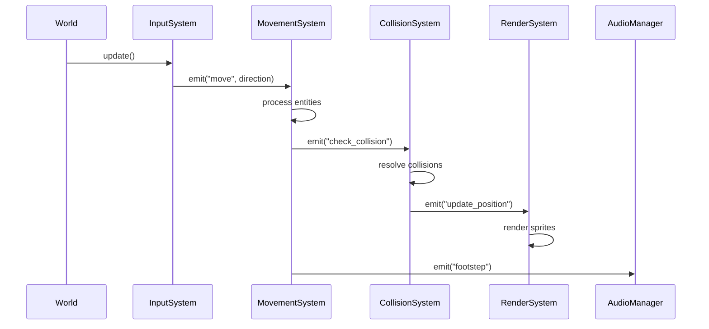
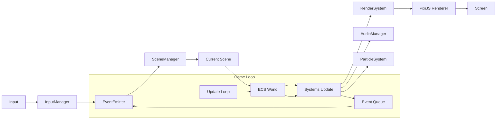
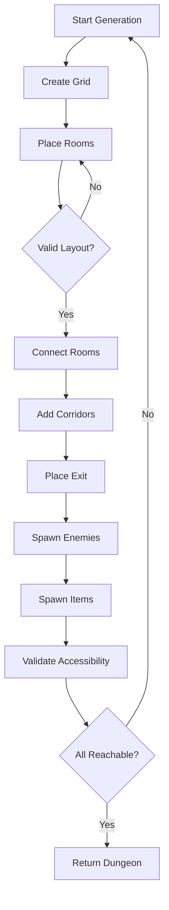

# System Design & Architecture

## Architecture Overview
**What is the high-level system structure?**

The game follows a layered architecture with clear separation between core engine, game logic, and reusable modules:



### Key Components and Responsibilities

**Application Layer (`src/core/`)**
- **Application.ts**: Bootstraps PixiJS, initializes managers, starts game loop
- **EventEmitter.ts**: Global event bus for decoupled communication
- **SceneManager.ts**: Manages scene lifecycle and transitions
- **DIContainer.ts**: Dependency injection for service management

**Game Layer (`src/game/`)**
- **ECS World**: Coordinates entities, components, and systems
- **Systems**: Process game logic (movement, combat, rendering, AI)
- **Components**: Store game state data (position, health, sprite data)
- **Entities**: Unique game objects (player, enemies, items, tiles)

**Module Layer (`src/modules/`)**
- Independent feature systems (audio, particles, quests, save)
- Can be enabled/disabled without affecting core game

### Technology Stack

- **Rendering**: PixiJS 8.0 - Hardware-accelerated 2D WebGL rendering
- **Language**: TypeScript 5.0 - Type safety and modern JS features
- **Build Tool**: Vite 6.0 - Fast development server and bundling
- **Audio**: @pixi/sound - Spatial audio and music management
- **Testing**: Jest (planned) - Unit and integration tests

## Data Models

### Core Entities and Relationships



### Entity Structure Example

```typescript
// Example entity with multiple components
{
  id: 123,
  archetype: "player",
  components: {
    position: { x: 100, y: 200, rotation: 0 },
    health: { hp: 50, maxHp: 50, armor: 5 },
    sprite: { texture: "player.png", layer: "characters" },
    velocity: { vx: 0, vy: 0, speed: 2 },
    collision: { bounds: [16, 16], shape: "AABB" },
    inventory: { items: [], capacity: 10 },
    ai: { behavior: "player", state: "idle" }
  }
}
```

### Component Data Schemas

**PositionComponent**
```json
{
  "x": number,
  "y": number,
  "rotation": number
}
```

**HealthComponent**
```json
{
  "hp": number,
  "maxHp": number,
  "armor": number,
  "regeneration": number
}
```

**InventoryComponent**
```json
{
  "items": Array<Item>,
  "capacity": number,
  "selectedSlot": number
}
```

## API Design

### Internal Event System

The game uses a centralized event bus for communication:

**Event Naming Convention**: `entity:action:detail`

Examples:
- `player:health:changed` - Player health updated
- `enemy:spawned` - New enemy created
- `item:picked_up` - Item collected by player
- `combat:damage_dealt` - Damage calculation
- `level:exit_reached` - Player reached exit

**Event Payload Structure**
```typescript
interface GameEvent {
  type: string;
  timestamp: number;
  data: Record<string, any>;
  source?: number; // entity ID
}
```

### System Communication Pattern



### Scene API

**SceneManager Interface**
```typescript
class SceneManager {
  transitionTo(scene: Scene): void;
  pause(): void;
  resume(): void;
  currentScene(): Scene | null;
}
```

## Component Breakdown

### Core Layer (`src/core/`)

**EventEmitter**
- Pub/sub pattern for loose coupling
- Handles event registration and emission
- Thread-safe event queue

**SceneManager**
- Manages scene lifecycle
- Handles transitions with fade effects
- Pause/resume functionality

**DIContainer**
- Service locator pattern
- Lazy initialization of dependencies
- Singleton instances

### Game Layer (`src/game/`)

**ECS World**
- Entity registry and component storage
- System registration and update loop
- Entity factory pattern

**Systems**
- **MovementSystem**: Applies velocity to position, respects collisions
- **RenderSystem**: Draws entities to screen using PixiJS
- **CombatSystem**: Handles damage, healing, death
- **CollisionSystem**: AABB collision detection and resolution
- **LightingSystem**: Field of view and dynamic lighting
- **InventorySystem**: Item management and equipment
- **AISystem**: Enemy behavior and state machines

**Components**
- Pure data containers (no logic)
- All logic in systems
- Serializable to JSON

**Entities**
- Created from JSON definitions
- Factory pattern for archetype creation
- Dynamic component assignment

### Module Layer (`src/modules/`)

**AudioManager**
- Sound effect playback with spatial audio
- Background music management
- Volume control per channel

**ParticleSystem**
- Visual effects for combat, explosions
- Efficient particle pooling
- Configurable effects

**QuestManager** (Future)
- Objective tracking
- Progress monitoring
- Reward distribution

**SaveManager** (Future)
- Game state serialization
- Local storage persistence
- Save slots

## Design Decisions

### Why ECS Architecture?

**Benefits**:
- Flexibility: Easy to add new entity types without changing existing code
- Performance: Systems can batch process entities efficiently
- Separation of concerns: Data (components) separate from logic (systems)
- Scalability: Can handle hundreds of entities easily

**Trade-offs**:
- Steeper learning curve than traditional OOP
- More boilerplate for simple entities
- Debugging can be harder with decoupled systems

**Alternatives Considered**:
- Traditional OOP: Too rigid for dynamic game entities
- Pure procedural: Not maintainable for complex game
- Hybrid approach: Combines complexity of both

### Why Data-Driven Design?

**Benefits**:
- Content creators can modify game without code changes
- Easy to balance and iterate on game values
- Enables modding and user-generated content
- Reduces hardcoded values scattered in code

**Implementation**:
All game entities (enemies, items, weapons) defined in JSON files

```json
{
  "archetype": "goblin",
  "components": {
    "health": { "hp": 20, "maxHp": 20, "armor": 2 },
    "ai": { "behavior": "aggressive", "range": 5 }
  }
}
```

### Why PixiJS?

**Benefits**:
- Hardware-accelerated rendering (WebGL)
- Rich feature set (textures, sprites, animation)
- Active community and good documentation
- Lightweight compared to full game engines

**Alternatives Considered**:
- Phaser: Too opinionated, more features than needed
- Three.js: Overkill for 2D game
- Canvas 2D: Not hardware accelerated

### Why Vite?

**Benefits**:
- Extremely fast development server
- Hot module replacement
- Simple configuration
- Modern ES modules out of the box

## Non-Functional Requirements

### Performance Targets

**Rendering**
- Maintain 60 FPS with 100+ entities
- Use sprite pooling for frequently created objects
- Batch sprite rendering calls

**Memory Management**
- Object pooling for projectiles and particles
- Texture atlas to reduce draw calls
- Unload unused scenes and assets

**Network**
- All assets loaded locally (no CDN dependency)
- Bundle size under 5MB compressed
- First frame under 2 seconds

### Scalability Considerations

**Entity Count**
- System is designed for 100-200 entities comfortably
- Space partitioning for collision detection at larger scales
- Disable distant entities to maintain performance

**Code Scalability**
- Modular architecture allows feature additions
- ECS pattern scales well with new entity types
- Clear boundaries between layers

### Security Requirements

**Client-Side Only**
- No authentication needed (single-player game)
- No sensitive data stored
- JSON files validated on load

**Input Validation**
- Validate all JSON game data on load
- Sanitize user input for future features (naming, etc.)
- Type checking prevents runtime errors

### Reliability/Availability Needs

**Error Handling**
- Graceful degradation when assets fail to load
- Fallback textures for missing images
- Error boundaries for critical failures

**Browser Compatibility**
- Modern browsers with WebGL 2.0
- Graceful degradation for older browsers
- Feature detection before initialization

## Data Flow Architecture



## Dungeon Generation Algorithm



**Algorithm Details**:
1. Binary Space Partitioning for room placement
2. Delaunay triangulation for room connections
3. A* pathfinding for corridor routing
4. Poisson disk sampling for enemy/item placement

